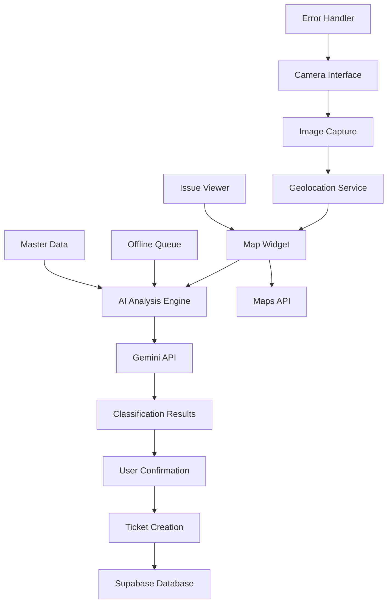

# Design Document: AI-Powered Issue Reporting

## Overview

The AI-Powered Issue Reporting system transforms civic engagement by eliminating manual data entry through intelligent image analysis. Citizens simply capture photos of civic issues, and the system automatically classifies, categorizes, and prioritizes them using Google Gemini. This design ensures rapid issue reporting while maintaining accuracy through user confirmation workflows.

The system follows a camera-first approach where the user experience is optimized for mobile devices and quick reporting. The AI analysis happens in real-time, providing immediate feedback and creating structured tickets that integrate seamlessly with the broader CivicFlow escalation and tracking systems.

## Architecture

The system follows a client-server architecture with AI processing handled through Google's Gemini API:



### Key Architectural Decisions

1. **Client-Side Camera Handling**: Camera access and image capture handled in the browser for immediate user feedback
2. **Server-Side AI Processing**: Gemini API calls made from the backend to protect API keys and enable request queuing
3. **Interactive Maps Integration**: Maps widget handles both location selection and issue visualization
4. **Progressive Enhancement**: Core functionality works without JavaScript, with enhanced UX when available
5. **Offline-First Design**: Images queued locally when network is unavailable

## Components and Interfaces

### Camera Interface Component
- **Purpose**: Handles device camera access and image capture
- **Key Methods**:
  - `initializeCamera()`: Activates camera with appropriate constraints
  - `captureImage()`: Takes photo and returns base64 encoded image
  - `switchCamera()`: Toggles between front/rear cameras
- **Error Handling**: Graceful fallback to file upload when camera unavailable

### AI Analysis Engine
- **Purpose**: Orchestrates image analysis workflow
- **Key Methods**:
  - `analyzeImage(imageData, location)`: Sends image to Gemini API
  - `validateClassification(result)`: Ensures result matches expected schema
  - `retryAnalysis(imageData)`: Handles API failures with exponential backoff
- **Integration**: Communicates with Gemini API via secure backend endpoint

### Geolocation Service
- **Purpose**: Captures accurate location data for issue reporting
- **Key Methods**:
  - `getCurrentLocation()`: Gets GPS coordinates with accuracy metadata
  - `reverseGeocode(lat, lng)`: Converts coordinates to human-readable address
  - `validateLocation(coordinates)`: Ensures location is within service area
- **Fallback**: Manual location selection via map interface

### Map Widget Component
- **Purpose**: Provides interactive map functionality for location selection and issue visualization
- **Key Methods**:
  - `initializeMap(center, zoom)`: Sets up map with initial view
  - `setMarker(lat, lng, draggable)`: Places location marker on map
  - `displayIssues(issues)`: Shows issue markers with category icons and severity colors
  - `onMarkerDrag(callback)`: Handles marker position changes
  - `fitBounds(coordinates)`: Adjusts map view to show all relevant points
- **Primary Integration**: Leaflet with OpenStreetMap (completely free)
- **Geocoding**: Nominatim API (free OSM geocoding service)
- **Features**: Drag-and-drop markers, zoom controls, multiple tile providers, issue clustering

### Ticket Management System
- **Purpose**: Creates and manages issue tickets
- **Key Methods**:
  - `createTicket(issueData)`: Stores new issue in database
  - `generateTicketId()`: Creates unique, user-friendly ticket identifiers
  - `updateTicketStatus(id, status)`: Handles status transitions
- **Integration**: Interfaces with Supabase for persistent storage

## Data Models

### Issue Ticket Model
```typescript
interface IssueTicker {
  id: string;                    // UUID primary key
  ticket_id: string;             // Human-readable ID (e.g., "CIV-2024-001234")
  created_at: Date;
  image_url: string;             // Supabase Storage URL
  description: string;           // AI-generated description
  category_id: string;           // From master data (e.g., "pothole")
  department: string;            // Assigned department (e.g., "PWD")
  severity_score: number;        // 1-10 scale
  status: IssueStatus;
  latitude: number;
  longitude: number;
  address: string;               // Human-readable location
  location_accuracy?: number;    // GPS accuracy in meters
  location_source: 'gps' | 'manual' | 'fallback'; // How location was determined
  upvotes: number;
  ai_confidence: number;         // AI classification confidence (0-1)
  user_confirmed: boolean;       // Whether user confirmed AI analysis
  embedding?: number[];          // For deduplication (future feature)
}

enum IssueStatus {
  OPEN = 'open',
  IN_PROGRESS = 'in_progress', 
  RESOLVED = 'resolved',
  ESCALATED = 'escalated',
  DUPLICATE = 'duplicate'
}
```

### Map Configuration Model
```typescript
interface MapConfig {
  provider: 'leaflet';                         // Using Leaflet with OSM
  tileLayer: string;                           // OSM tile server URL
  attribution: string;                         // Map attribution text
  defaultCenter: {                             // Default map center
    lat: number;
    lng: number;
  };
  defaultZoom: number;                         // Default zoom level
  maxZoom: number;                             // Maximum zoom level
  serviceBounds: {                             // Service area boundaries
    north: number;
    south: number;
    east: number;
    west: number;
  };
  markerIcons: Record<string, string>;         // Category to icon URL mapping
  severityColors: Record<number, string>;      // Severity to color mapping
  geocodingService: 'nominatim';               // Free geocoding service
}
```

### AI Classification Response
```typescript
interface AIClassificationResult {
  is_civic: boolean;
  category: string;              // Maps to category_id in master data
  severity: number;              // 1-10 scale
  description: string;           // Natural language description
  confidence: number;            // AI confidence score (0-1)
  department: string;            // Inferred from category
  reasoning?: string;            // Optional explanation of classification
}
```

### Master Data Models
```typescript
interface Department {
  id: string;                    // e.g., "PWD"
  name: string;                  // e.g., "Public Works Department"
  escalation_contact: string;    // Email for escalations
  sla_hours: Record<string, number>; // Severity level to hours mapping
}

interface Category {
  id: string;                    // e.g., "pothole"
  label: string;                 // Display name
  department_id: string;         // Foreign key to Department
  severity_default: number;      // Default severity (1-10)
  icon: string;                  // Lucide icon name
  description: string;           // Category description
  keywords: string[];            // AI training keywords
}
```

## Correctness Properties

*A property is a characteristic or behavior that should hold true across all valid executions of a system-essentially, a formal statement about what the system should do. Properties serve as the bridge between human-readable specifications and machine-verifiable correctness guarantees.*

### Property Reflection

After analyzing all acceptance criteria, several properties can be consolidated to eliminate redundancy:
- SLA assignment properties (3.2, 3.3, 3.4) can be combined into one comprehensive SLA mapping property
- Data storage properties (1.2, 4.5) can be combined into one comprehensive data persistence property
- UI feedback properties (4.1, 5.1, 5.3) can be combined into one comprehensive user feedback property

### Core Properties

**Property 1: Camera Interface Activation**
*For any* user session where the reporting interface is opened, the camera interface should automatically request camera permissions and activate the camera stream
**Validates: Requirements 1.1**

**Property 2: Complete Data Persistence**
*For any* photo capture or ticket creation, the system should store all required metadata including image, timestamp, geolocation, AI analysis results, and user confirmation status
**Validates: Requirements 1.2, 4.5**

**Property 3: Camera Type Support**
*For any* mobile device with multiple cameras, the camera interface should support switching between front and rear cameras
**Validates: Requirements 1.5**

**Property 4: AI Analysis Triggering**
*For any* captured image, the system should automatically trigger AI analysis via the Gemini API
**Validates: Requirements 2.1**

**Property 5: Structured Classification Response**
*For any* completed AI analysis, the response should contain all required fields: category, department, description, severity, and confidence score
**Validates: Requirements 2.2**

**Property 6: Category Mapping Consistency**
*For any* civic issue classification, the assigned category should be from the predefined master data and map to the correct department
**Validates: Requirements 2.3, 2.5, 7.1**

**Property 7: Severity Score Validity**
*For any* issue classification, the assigned severity score should be an integer between 1 and 10 inclusive
**Validates: Requirements 3.1**

**Property 8: SLA Assignment Logic**
*For any* severity score, the system should assign the correct SLA timeline: 1-4 (3 days), 5-7 (24 hours), 8-10 (12 hours)
**Validates: Requirements 3.2, 3.3, 3.4**

**Property 9: User Feedback Consistency**
*For any* system operation (analysis start, completion, success, failure), appropriate user feedback should be displayed with relevant information
**Validates: Requirements 4.1, 5.1, 5.3**

**Property 10: Ticket Creation on Confirmation**
*For any* user confirmation of AI analysis, a new ticket should be created in the database with a unique ticket ID
**Validates: Requirements 4.2, 4.4**

**Property 11: Response Time Performance**
*For any* AI processing operation, results should be returned and displayed within 5 seconds of image capture
**Validates: Requirements 5.2**

**Property 12: Offline Queue Management**
*For any* submission attempt while offline, the data should be queued locally and processed when connectivity is restored
**Validates: Requirements 5.5, 6.1**

**Property 13: Input Data Validation**
*For any* data input (image, location, user input), the system should validate it before storage and reject invalid data with appropriate error messages
**Validates: Requirements 6.5**

**Property 14: Master Data Consistency**
*For any* classification operation, the system should reference current master data and maintain consistency with department escalation rules
**Validates: Requirements 7.3, 7.4**

**Property 15: Classification Response Completeness**
*For any* classification response, it should include category icons, descriptions, and all UI metadata required for user display
**Validates: Requirements 7.5**

**Property 16: Map Widget Initialization**
*For any* map widget instantiation, the map should initialize with appropriate center coordinates and zoom level based on user location or default area
**Validates: Requirements 8.1, 8.3**

**Property 17: Location Marker Precision**
*For any* location selection via map, the coordinates should be accurate to within the map's current zoom precision and validated against service area boundaries
**Validates: Requirements 8.2, 8.7**

**Property 18: Issue Marker Display**
*For any* set of issues displayed on the map, each issue should be represented with the correct category icon and severity color coding
**Validates: Requirements 8.4, 8.5**

## Error Handling

### Camera and Media Errors
- **Camera Access Denied**: Graceful fallback to file upload with clear user messaging
- **Camera Hardware Failure**: Automatic detection and fallback to alternative input methods
- **Image Capture Failure**: Retry mechanism with user feedback and manual alternatives

### AI Processing Errors
- **Gemini API Unavailable**: Queue images for processing with exponential backoff retry
- **API Rate Limiting**: Implement request queuing with user progress indicators
- **Invalid AI Response**: Fallback to manual category selection with error logging
- **Low Confidence Classifications**: Flag for manual review while allowing user override

### Network and Connectivity
- **Offline Mode**: Local storage of submissions with sync when online
- **Intermittent Connectivity**: Robust retry logic with user status updates
- **Slow Network**: Progressive loading with timeout handling and user feedback

### Data and Storage Errors
- **Database Unavailable**: Local queuing with automatic retry and user notification
- **Storage Quota Exceeded**: Image compression and cleanup with user alerts
- **Data Corruption**: Validation and recovery mechanisms with user re-submission options

### Location and Geospatial Errors
- **GPS Unavailable**: Manual location selection via map interface
- **Location Permission Denied**: Address input with geocoding validation
- **Invalid Coordinates**: Boundary checking with user correction prompts

## Testing Strategy

### Dual Testing Approach
The system requires both unit testing and property-based testing for comprehensive coverage:

**Unit Tests**: Focus on specific examples, edge cases, and error conditions including:
- Camera permission handling scenarios
- AI API response parsing with various response formats
- Database connection failures and recovery
- Offline queue management edge cases
- Location validation boundary conditions
- Map widget initialization and interaction scenarios
- GPS accuracy and fallback location selection

**Property-Based Tests**: Verify universal properties across all inputs including:
- Data persistence completeness across random image captures
- Classification consistency across various civic issue images
- SLA assignment accuracy across all severity scores
- User feedback consistency across different system states
- Input validation effectiveness across random invalid inputs
- Map marker positioning accuracy across coordinate ranges
- Issue visualization consistency across different map zoom levels

### Property-Based Testing Configuration
- **Testing Library**: fast-check for TypeScript/JavaScript property-based testing
- **Test Iterations**: Minimum 100 iterations per property test
- **Test Tagging**: Each property test tagged with format: **Feature: ai-powered-issue-reporting, Property {number}: {property_text}**

### Integration Testing
- **End-to-End Flows**: Complete user journeys from camera capture to ticket creation
- **API Integration**: Gemini API integration with various image types and error scenarios
- **Database Integration**: Supabase operations with concurrent access and failure scenarios
- **Maps Integration**: Google Maps/OSM API integration with location services
- **Cross-Browser Testing**: Camera functionality across different browsers and devices
- **Mobile Testing**: Touch interactions and responsive behavior on mobile devices

### Performance Testing
- **Image Processing Speed**: Verify 5-second response time requirement
- **Concurrent User Load**: Test system behavior under multiple simultaneous submissions
- **Memory Usage**: Monitor memory consumption during image processing and storage
- **Network Efficiency**: Optimize image upload and API call efficiency