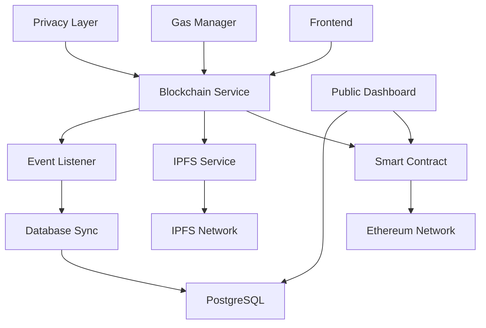

# Design Document: Blockchain Transparency

## Overview

The Blockchain Transparency system leverages Ethereum smart contracts and IPFS to create an immutable, verifiable record of grievances and their resolution process. The design ensures data integrity while maintaining privacy compliance through careful separation of on-chain and off-chain data.

The system uses a hybrid approach where sensitive personal data remains in traditional databases while critical verification data (hashes, timestamps, status changes) are stored on the blockchain. This provides transparency and immutability while respecting privacy regulations.

## Architecture



### Key Architectural Decisions

1. **Hybrid Storage Model**: Personal data in database, verification data on blockchain
2. **Event-Driven Synchronization**: Real-time sync between blockchain and database
3. **Gas Optimization**: Intelligent batching and timing of blockchain operations
4. **Privacy by Design**: Zero personal data on blockchain, only hashes and IDs
5. **Upgradeable Contracts**: Proxy pattern for contract evolution

## Components and Interfaces

### Smart Contract Architecture

#### GrievanceRegistry Contract
```solidity
contract GrievanceRegistry is Ownable, ReentrancyGuard, UUPSUpgradeable {
    struct GrievanceRecord {
        string ticketId;
        string ipfsHash;
        uint8 severity;
        uint256 timestamp;
        address reporter;
        GrievanceStatus status;
    }
    
    enum GrievanceStatus { OPEN, IN_PROGRESS, RESOLVED, ESCALATED }
    
    mapping(string => GrievanceRecord) public grievances;
    mapping(address => string[]) public userGrievances;
    
    event GrievanceRegistered(string indexed ticketId, address indexed reporter, string ipfsHash, uint8 severity);
    event StatusUpdated(string indexed ticketId, GrievanceStatus newStatus, address updatedBy);
    event BatchProcessed(uint256 count, uint256 gasUsed);
}
```

#### Key Contract Methods
- `registerGrievance(string ticketId, string ipfsHash, uint8 severity)`: Records new grievance
- `updateStatus(string ticketId, GrievanceStatus newStatus)`: Updates grievance status
- `batchRegister(GrievanceRecord[] grievances)`: Batch processing for gas optimization
- `getGrievanceHistory(string ticketId)`: Retrieves complete grievance timeline

### Blockchain Service Layer

#### BlockchainService Class
```typescript
class BlockchainService {
  private contract: Contract;
  private gasManager: GasManager;
  private eventListener: EventListener;
  
  async registerGrievance(grievanceData: GrievanceData): Promise<TransactionResult> {
    const gasPrice = await this.gasManager.getOptimalGasPrice();
    const tx = await this.contract.registerGrievance(
      grievanceData.ticketId,
      grievanceData.ipfsHash,
      grievanceData.severity,
      { gasPrice }
    );
    return this.waitForConfirmation(tx);
  }
  
  async batchRegister(grievances: GrievanceData[]): Promise<TransactionResult> {
    // Batch multiple registrations for gas efficiency
  }
  
  async verifyGrievance(ticketId: string): Promise<VerificationResult> {
    // Verify grievance exists on blockchain
  }
}
```

### IPFS Integration

#### IPFSService Class
```typescript
class IPFSService {
  private client: IPFSHTTPClient;
  
  async uploadFile(file: Buffer, metadata: FileMetadata): Promise<string> {
    const result = await this.client.add({
      content: file,
      pin: true
    });
    return result.cid.toString();
  }
  
  async retrieveFile(hash: string): Promise<Buffer> {
    const chunks = [];
    for await (const chunk of this.client.cat(hash)) {
      chunks.push(chunk);
    }
    return Buffer.concat(chunks);
  }
  
  async validateIntegrity(hash: string, content: Buffer): Promise<boolean> {
    // Verify content matches IPFS hash
  }
}
```

### Event Monitoring System

#### EventListener Class
```typescript
class EventListener {
  private contract: Contract;
  private syncService: DatabaseSyncService;
  
  async startListening(): Promise<void> {
    this.contract.on('GrievanceRegistered', this.handleGrievanceRegistered);
    this.contract.on('StatusUpdated', this.handleStatusUpdated);
    
    // Handle blockchain reorganizations
    this.setupReorgHandling();
  }
  
  private async handleGrievanceRegistered(ticketId: string, reporter: string, ipfsHash: string, severity: number): Promise<void> {
    await this.syncService.updateGrievanceBlockchainStatus(ticketId, {
      blockchainConfirmed: true,
      transactionHash: event.transactionHash,
      blockNumber: event.blockNumber
    });
  }
}
```

### Gas Management System

#### GasManager Class
```typescript
class GasManager {
  private gasTracker: GasTracker;
  private batchQueue: TransactionQueue;
  
  async getOptimalGasPrice(): Promise<BigNumber> {
    const networkGasPrice = await this.provider.getGasPrice();
    const historicalData = await this.gasTracker.getHistoricalPrices();
    
    // Use EIP-1559 gas pricing when available
    return this.calculateOptimalPrice(networkGasPrice, historicalData);
  }
  
  async queueTransaction(transaction: PendingTransaction): Promise<void> {
    if (await this.isGasPriceHigh()) {
      this.batchQueue.add(transaction);
    } else {
      await this.executeTransaction(transaction);
    }
  }
}
```

## Data Models

### Blockchain Data Models

```typescript
interface GrievanceBlockchainRecord {
  ticketId: string;
  ipfsHash: string;
  severity: number;
  timestamp: number;
  reporter: string;
  status: BlockchainGrievanceStatus;
  transactionHash: string;
  blockNumber: number;
}

interface BlockchainSyncStatus {
  lastProcessedBlock: number;
  syncedAt: Date;
  pendingTransactions: number;
  failedTransactions: string[];
}

interface TransactionResult {
  success: boolean;
  transactionHash?: string;
  blockNumber?: number;
  gasUsed?: number;
  error?: string;
}
```

### IPFS Data Models

```typescript
interface IPFSFileRecord {
  hash: string;
  filename: string;
  size: number;
  mimeType: string;
  uploadedAt: Date;
  pinned: boolean;
}

interface FileMetadata {
  originalName: string;
  size: number;
  mimeType: string;
  checksum: string;
  uploadedBy: string;
}
```

## Correctness Properties

*A property is a characteristic or behavior that should hold true across all valid executions of a system-essentially, a formal statement about what the system should do. Properties serve as the bridge between human-readable specifications and machine-verifiable correctness guarantees.*

**Property 1: Blockchain Registration Completeness**
*For any* grievance created in the system, it should eventually be registered on the blockchain with a valid transaction hash
**Validates: Requirements 1.1, 1.2**

**Property 2: IPFS Storage Integrity**
*For any* file uploaded to IPFS, retrieving it using the returned hash should yield identical content
**Validates: Requirements 2.1, 2.4**

**Property 3: Event Synchronization Consistency**
*For any* blockchain event emitted, the local database should be updated to reflect the same state change
**Validates: Requirements 7.2, 7.3**

**Property 4: Gas Optimization Effectiveness**
*For any* batch of transactions, the total gas cost should be less than individual transaction costs
**Validates: Requirements 6.3**

**Property 5: Privacy Preservation**
*For any* data stored on the blockchain, it should contain no personally identifiable information
**Validates: Requirements 8.1, 8.2**

**Property 6: Status Update Verification**
*For any* status change recorded on the blockchain, it should be verifiable through the smart contract
**Validates: Requirements 3.1, 3.4**

**Property 7: Access Control Enforcement**
*For any* write operation to the smart contract, it should only succeed if called by an authorized address
**Validates: Requirements 5.1**

**Property 8: Transaction Retry Logic**
*For any* failed blockchain transaction, the system should retry up to 3 times before marking it as failed
**Validates: Requirements 1.3**

## Error Handling

### Blockchain Network Errors
- **Network Congestion**: Queue transactions and retry with higher gas prices
- **Node Unavailability**: Failover to backup RPC endpoints
- **Transaction Failures**: Retry with adjusted gas limits and prices
- **Blockchain Reorganizations**: Detect and handle chain reorgs gracefully

### Smart Contract Errors
- **Contract Upgrade Failures**: Rollback mechanisms and emergency procedures
- **Gas Limit Exceeded**: Dynamic gas estimation and optimization
- **Access Control Violations**: Proper error handling and user feedback
- **State Inconsistencies**: Validation and recovery procedures

### IPFS Network Errors
- **Upload Failures**: Retry with exponential backoff
- **Content Unavailable**: Multiple gateway fallbacks
- **Pinning Failures**: Alternative pinning services
- **Network Partitions**: Local caching and delayed sync

### Synchronization Errors
- **Event Processing Failures**: Dead letter queues and manual intervention
- **Database Inconsistencies**: Reconciliation procedures
- **Missing Events**: Block range scanning and recovery
- **Duplicate Processing**: Idempotency checks and deduplication

## Testing Strategy

### Smart Contract Testing
- **Unit Tests**: Individual contract function testing with Hardhat
- **Integration Tests**: Full contract interaction flows
- **Security Tests**: Reentrancy, overflow, and access control testing
- **Gas Optimization Tests**: Gas usage analysis and optimization verification

### Blockchain Service Testing
- **Mock Testing**: Test with local blockchain networks
- **Property Tests**: Verify blockchain interaction properties
- **Load Testing**: Concurrent transaction handling
- **Failure Testing**: Network failure and recovery scenarios

### IPFS Testing
- **Content Integrity Tests**: Hash verification and content matching
- **Availability Tests**: Multiple gateway testing
- **Performance Tests**: Upload and download speed optimization
- **Resilience Tests**: Network partition and recovery testing

### End-to-End Testing
- **Full Flow Testing**: Complete grievance lifecycle on testnet
- **Cross-Service Integration**: Database, blockchain, and IPFS coordination
- **Performance Testing**: System behavior under load
- **Security Testing**: Privacy and access control validation