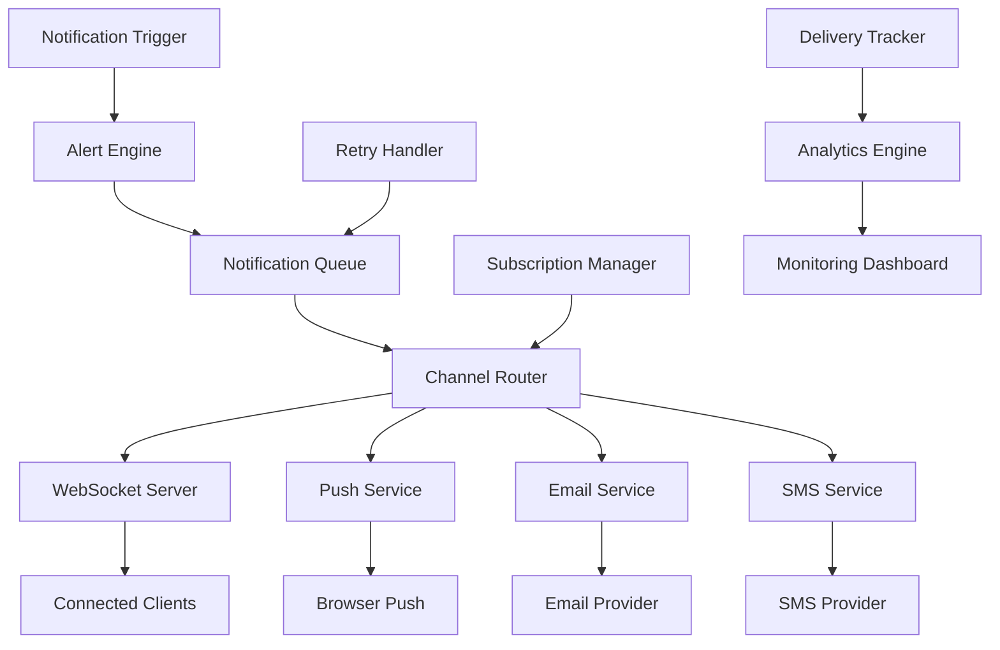

# Design Document: Real-Time Notifications

## Overview

The Real-Time Notifications system provides comprehensive communication infrastructure for the Jan-Samadhan platform, ensuring all stakeholders receive timely updates through their preferred channels. The system uses WebSocket connections for real-time delivery, with robust fallback mechanisms including push notifications, email, and SMS.

The design emphasizes reliability, scalability, and user experience, with intelligent routing based on urgency, user preferences, and delivery success rates. The system handles high-volume notification scenarios while preventing spam and maintaining user engagement.

## Architecture



### Key Architectural Decisions

1. **Multi-Channel Delivery**: Support for WebSocket, push, email, and SMS with intelligent fallback
2. **Queue-Based Processing**: Reliable message delivery with retry mechanisms
3. **User Preference Engine**: Granular control over notification types and channels
4. **Analytics Integration**: Comprehensive tracking of delivery and engagement metrics
5. **Scalable WebSocket Architecture**: Socket.io with Redis adapter for horizontal scaling

## Components and Interfaces

### Alert Engine

#### NotificationEngine Class
```typescript
class NotificationEngine {
  private queueService: NotificationQueue;
  private subscriptionManager: SubscriptionManager;
  private channelRouter: ChannelRouter;
  
  async triggerNotification(event: NotificationEvent): Promise<void> {
    const recipients = await this.determineRecipients(event);
    const urgency = this.calculateUrgency(event);
    
    for (const recipient of recipients) {
      const preferences = await this.subscriptionManager.getPreferences(recipient.id);
      const channels = this.selectChannels(urgency, preferences);
      
      await this.queueService.enqueue({
        recipientId: recipient.id,
        event,
        channels,
        urgency,
        scheduledAt: this.calculateDeliveryTime(urgency)
      });
    }
  }
  
  private calculateUrgency(event: NotificationEvent): NotificationUrgency {
    // Determine urgency based on event type, SLA status, and escalation level
  }
}
```

### WebSocket Server

#### SocketService Class
```typescript
class SocketService {
  private io: Server;
  private redisAdapter: RedisAdapter;
  private connectionManager: ConnectionManager;
  
  async initialize(): Promise<void> {
    this.io = new Server(server, {
      cors: { origin: process.env.FRONTEND_URL },
      adapter: createAdapter(redisClient)
    });
    
    this.io.on('connection', this.handleConnection.bind(this));
  }
  
  async sendToUser(userId: string, notification: Notification): Promise<boolean> {
    const userSockets = await this.connectionManager.getUserSockets(userId);
    
    if (userSockets.length === 0) {
      return false; // User offline, trigger fallback
    }
    
    this.io.to(userSockets).emit('notification', notification);
    return true;
  }
  
  async sendToRoom(roomId: string, notification: Notification): Promise<void> {
    this.io.to(roomId).emit('notification', notification);
  }
}
```

### Push Notification Service

#### PushService Class
```typescript
class PushService {
  private webPush: WebPushLibrary;
  private subscriptionStore: PushSubscriptionStore;
  
  async sendPushNotification(userId: string, notification: PushNotification): Promise<boolean> {
    const subscriptions = await this.subscriptionStore.getUserSubscriptions(userId);
    
    const results = await Promise.allSettled(
      subscriptions.map(subscription => 
        this.webPush.sendNotification(subscription, JSON.stringify(notification))
      )
    );
    
    // Clean up invalid subscriptions
    await this.cleanupFailedSubscriptions(subscriptions, results);
    
    return results.some(result => result.status === 'fulfilled');
  }
  
  async registerSubscription(userId: string, subscription: PushSubscription): Promise<void> {
    await this.subscriptionStore.saveSubscription(userId, subscription);
  }
}
```

### Email Service

#### EmailService Class
```typescript
class EmailService {
  private transporter: Transporter;
  private templateEngine: TemplateEngine;
  
  async sendEmail(recipient: EmailRecipient, notification: EmailNotification): Promise<boolean> {
    try {
      const template = await this.templateEngine.render(notification.template, notification.data);
      
      const mailOptions = {
        from: process.env.SMTP_FROM,
        to: recipient.email,
        subject: notification.subject,
        html: template,
        headers: {
          'List-Unsubscribe': `<${this.getUnsubscribeUrl(recipient.id)}>`,
          'X-Notification-Type': notification.type
        }
      };
      
      await this.transporter.sendMail(mailOptions);
      return true;
    } catch (error) {
      console.error('Email delivery failed:', error);
      return false;
    }
  }
}
```

### Subscription Management

#### SubscriptionManager Class
```typescript
class SubscriptionManager {
  private database: Database;
  private cacheService: CacheService;
  
  async getPreferences(userId: string): Promise<NotificationPreferences> {
    const cached = await this.cacheService.get(`preferences:${userId}`);
    if (cached) return cached;
    
    const preferences = await this.database.getUserPreferences(userId);
    await this.cacheService.set(`preferences:${userId}`, preferences, 3600);
    
    return preferences;
  }
  
  async updatePreferences(userId: string, preferences: Partial<NotificationPreferences>): Promise<void> {
    await this.database.updateUserPreferences(userId, preferences);
    await this.cacheService.delete(`preferences:${userId}`);
    
    // Emit preference change event for real-time updates
    this.eventEmitter.emit('preferences:updated', { userId, preferences });
  }
}
```

## Data Models

### Notification Models

```typescript
interface Notification {
  id: string;
  type: NotificationType;
  title: string;
  message: string;
  data: Record<string, any>;
  urgency: NotificationUrgency;
  channels: NotificationChannel[];
  recipientId: string;
  createdAt: Date;
  scheduledAt: Date;
  deliveredAt?: Date;
  readAt?: Date;
}

enum NotificationType {
  GRIEVANCE_STATUS_UPDATE = 'grievance_status_update',
  ASSIGNMENT_NOTIFICATION = 'assignment_notification',
  ESCALATION_ALERT = 'escalation_alert',
  COMMUNITY_UPDATE = 'community_update',
  SYSTEM_ANNOUNCEMENT = 'system_announcement'
}

enum NotificationUrgency {
  LOW = 'low',
  MEDIUM = 'medium',
  HIGH = 'high',
  CRITICAL = 'critical'
}

enum NotificationChannel {
  WEBSOCKET = 'websocket',
  PUSH = 'push',
  EMAIL = 'email',
  SMS = 'sms'
}
```

### User Preferences Model

```typescript
interface NotificationPreferences {
  userId: string;
  channels: {
    websocket: boolean;
    push: boolean;
    email: boolean;
    sms: boolean;
  };
  types: {
    grievance_updates: boolean;
    assignments: boolean;
    escalations: boolean;
    community_updates: boolean;
    system_announcements: boolean;
  };
  frequency: NotificationFrequency;
  quietHours: {
    enabled: boolean;
    start: string; // HH:mm format
    end: string;   // HH:mm format
    timezone: string;
  };
  location: {
    enabled: boolean;
    radius: number; // kilometers
    coordinates: {
      latitude: number;
      longitude: number;
    };
  };
}

enum NotificationFrequency {
  IMMEDIATE = 'immediate',
  HOURLY_DIGEST = 'hourly_digest',
  DAILY_DIGEST = 'daily_digest',
  WEEKLY_DIGEST = 'weekly_digest'
}
```

### Delivery Tracking Models

```typescript
interface DeliveryAttempt {
  id: string;
  notificationId: string;
  channel: NotificationChannel;
  attemptedAt: Date;
  success: boolean;
  error?: string;
  responseTime: number;
  metadata: Record<string, any>;
}

interface DeliveryStats {
  channel: NotificationChannel;
  totalSent: number;
  delivered: number;
  failed: number;
  deliveryRate: number;
  averageResponseTime: number;
  lastUpdated: Date;
}
```

## Correctness Properties

*A property is a characteristic or behavior that should hold true across all valid executions of a system-essentially, a formal statement about what the system should do. Properties serve as the bridge between human-readable specifications and machine-verifiable correctness guarantees.*

**Property 1: Real-Time Delivery Guarantee**
*For any* notification with high or critical urgency, it should be delivered via WebSocket within 2 seconds if the recipient is online
**Validates: Requirements 1.1**

**Property 2: Fallback Channel Activation**
*For any* failed primary channel delivery, the system should attempt delivery via the next preferred channel within 30 seconds
**Validates: Requirements 6.1, 6.2**

**Property 3: Notification Deduplication**
*For any* rapid sequence of similar notifications to the same user, only the most recent should be delivered to prevent spam
**Validates: Requirements 1.5**

**Property 4: Preference Enforcement**
*For any* notification sent to a user, it should only use channels and types that match their current preferences
**Validates: Requirements 7.2, 7.4**

**Property 5: Escalation Timing Accuracy**
*For any* grievance approaching SLA deadline, escalation notifications should be sent at exactly 75%, 100%, and 125% of the deadline
**Validates: Requirements 3.3**

**Property 6: Delivery Tracking Completeness**
*For any* notification sent through any channel, a delivery attempt record should be created with success/failure status
**Validates: Requirements 8.2**

**Property 7: Queue Processing Reliability**
*For any* notification added to the queue, it should eventually be processed or marked as permanently failed after maximum retry attempts
**Validates: Requirements 1.3**

**Property 8: Geographic Filtering Accuracy**
*For any* location-based community notification, it should only be sent to users within the specified geographic radius
**Validates: Requirements 4.1, 4.5**

## Error Handling

### WebSocket Connection Errors
- **Connection Drops**: Automatic reconnection with exponential backoff
- **Message Delivery Failures**: Queue messages for retry when connection restored
- **Server Overload**: Load balancing and connection throttling
- **Client-Side Errors**: Graceful degradation to polling fallback

### Push Notification Errors
- **Invalid Subscriptions**: Automatic cleanup of expired/invalid subscriptions
- **Service Unavailable**: Fallback to alternative notification channels
- **Permission Denied**: User education and alternative channel suggestions
- **Payload Too Large**: Message truncation with "read more" links

### Email Delivery Errors
- **SMTP Failures**: Multiple provider fallback and retry logic
- **Invalid Addresses**: Address validation and cleanup
- **Spam Filtering**: Authentication setup and content optimization
- **Rate Limiting**: Queue management and throttling

### SMS Delivery Errors
- **Invalid Numbers**: Number validation and formatting
- **Carrier Blocking**: Multiple provider routing
- **International Restrictions**: Country-specific handling
- **Cost Management**: Budget controls and usage monitoring

## Testing Strategy

### Real-Time Testing
- **WebSocket Connection Tests**: Connection establishment, message delivery, and reconnection
- **Concurrent User Tests**: Multiple simultaneous connections and message broadcasting
- **Network Failure Tests**: Connection drops, server restarts, and recovery scenarios
- **Performance Tests**: Message throughput and latency under load

### Channel Integration Testing
- **Push Notification Tests**: Subscription management, message delivery, and error handling
- **Email Delivery Tests**: Template rendering, SMTP integration, and bounce handling
- **SMS Integration Tests**: Provider APIs, international formatting, and delivery confirmation
- **Fallback Chain Tests**: Primary channel failure and automatic fallback activation

### Property-Based Testing
- **Delivery Guarantee Tests**: Verify timing requirements across different urgency levels
- **Preference Compliance Tests**: Ensure notifications respect user settings
- **Geographic Filtering Tests**: Validate location-based notification accuracy
- **Queue Processing Tests**: Verify reliable message processing and retry logic

### User Experience Testing
- **Notification Timing Tests**: Verify appropriate delivery timing and batching
- **Preference Management Tests**: User interface for managing notification settings
- **Unsubscribe Flow Tests**: Easy opt-out mechanisms and preference updates
- **Mobile Experience Tests**: Push notifications, deep linking, and offline behavior