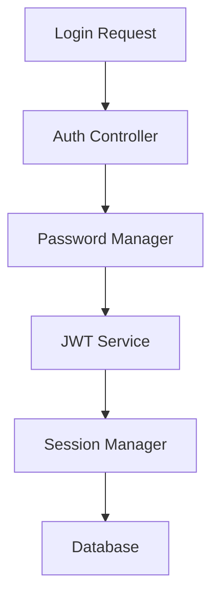

# Design Document: User Authentication

## Overview

The User Authentication system provides secure, role-based access control using JWT tokens, bcrypt password hashing, and comprehensive session management for the Jan-Samadhan platform.

## Architecture



## Components and Interfaces

### AuthController Class
```typescript
class AuthController {
  async login(email: string, password: string): Promise<AuthResult> {
    const user = await this.userService.findByEmail(email);
    const isValid = await this.passwordManager.verify(password, user.passwordHash);
    
    if (isValid) {
      const token = await this.jwtService.generateToken(user);
      return { success: true, token, user };
    }
    
    return { success: false, error: 'Invalid credentials' };
  }
}
```

## Correctness Properties

**Property 1: Password Security**
*For any* password stored in the system, it should be hashed using bcrypt with minimum 12 rounds
**Validates: Requirements 1.4**

**Property 2: Role-Based Access**
*For any* authenticated request, access should be granted only if the user's role permits the action
**Validates: Requirements 2.3**